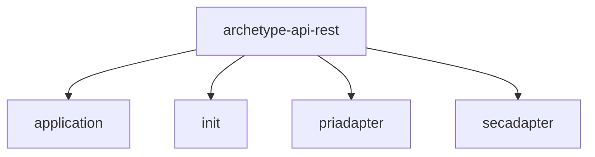
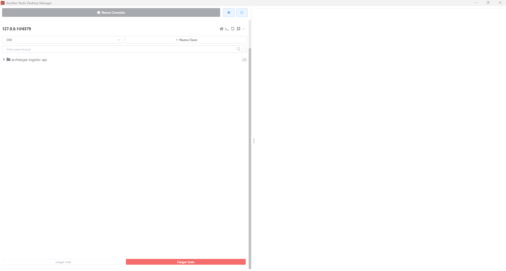
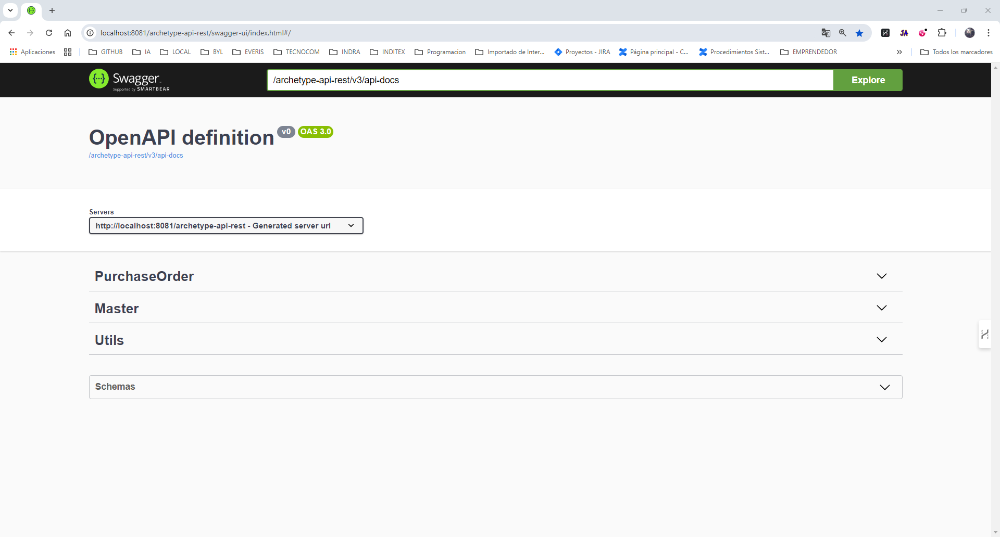

# Arquetipo Logística API

Arquetipo para proyectos API Rest.

Sigue una arquitectura hexagonal.



## Comenzando 🚀

Pasos a seguir para poder arracar el proyecto:

1. Descargar el proyecto de github
2. Descargar el proyecto de Docker de github
3. Seguir las indicaciones de la sección [Instalación](#instalacion)  

## Dependencias

```
<!-- DEPENDENCIES_START -->
<!-- DEPENDENCIES_START -->
```

## Pre-requisitos 📋

* Jdk21
* Docker

## Instalación 🔧 {#instalacion}

Por defecto la aplicación se inicia en el puerto 8081.

El API de entrada de swagger sería http://localhost:8081/archetype-api-rest/swagger-ui/index.html#/ 

### Compilar aplicación

```
mvn clean install
```

### Arrancando docker

Abrir un terminad cmd, situarse en la carpeta de "Docker" del proyecto y ejecutar el comando:

```
docker-compose up
```
Este comando iniciará las distintas apps necesarias para el funcionamiento de la aplicación.

Estas aplicaciones son las siguientes:

* Postgres
  * Arranca en el puerto 15432 
* Grafana
    * http://localhost:3000/
* Prometheus
  * http://localhost:9090/graph
* Elastic
  * http://localhost:9200/
* Kibana
    * http://localhost:5601/app/home#/
* Redis
  * Acceder con un cliente para Redis como por ejemplo "Another Redis Desktop Manager" https://goanother.com/
  * Arranca en el puerto 6379
  


### Arrancar aplicación

#### Variables de entorno a configurar

```
GITHUB=https://github.com/Mdr1983/config.git;
SCCS=http://localhost:8889;
SHORT_ENV=local;
```

#### Si se inicia con el SCCS

```
spring:
application:
name: archetype-api-rest
cloud:
config:
failFast: true
enabled: true
name: ${spring.application.name}
profile: ${SHORT_ENV}
uri: ${SCCS}
server:
git:
search-paths: config
logging:
config: ${SCCS}/sccs/${spring.application.name}/${SHORT_ENV}/master/base_logback.xml
```

#### Iniciar aplicación

```
java -jar init/target/init.jar
```

### Verificar arranque aplicación

Si todo ha ido correcto la aplicación se iniciará y se podrá verificar con swagger. 

Para ello acceder a la URL http://localhost:8081/archetype-api-rest/swagger-ui/index.html#/



## Ejecutando las pruebas ⚙️

_Explica como ejecutar las pruebas automatizadas para este sistema_

### Analice las pruebas end-to-end 🔩

_Explica que verifican estas pruebas y por qué_

```
Da un ejemplo
```

### Y las pruebas de estilo de codificación ⌨️

_Explica que verifican estas pruebas y por qué_

```
Da un ejemplo
```

## Despliegue 📦

_Agrega notas adicionales sobre como hacer deploy_

## Construído con 🛠️

_Herramientas usadas_

* [Spring](https://spring.io/) - Framework web
* [Maven](https://maven.apache.org/) - Manejador de dependencias
* [Postgres](https://www.postgresql.org/) - BBDD
* [Grafana](https://grafana.com/) - Monitorización
* [Prometheus](https://prometheus.io/) - Monitorización
* [Elastic](https://www.elastic.co/es/) - Logs
* [Kibana](https://www.elastic.co/es/kibana) - Visualización Logs
* [Redis](https://redis.io/) - Cache redis


## Contribuyendo 🖇️

Por favor lee el [CONTRIBUTING.md](https://gist.github.com/villanuevand/xxxxxx) para detalles de nuestro código de conducta, y el proceso para enviarnos pull requests.

## Wiki 📖

Puedes encontrar mucho más de cómo utilizar este proyecto en nuestra [Wiki](https://github.com/tu/proyecto/wiki)

## Versionado 📌

Usamos [SemVer](http://semver.org/) para el versionado. 

Para todas las versiones disponibles, mira los [tags](https://github.com/Mdr1983/archetype-api-rest/tags).

## Autores ✒️

* **Manuel Demanuel Rodríguez** - [Mdr1983](https://github.com/Mdr1983)

También puedes mirar la lista de todos los [contribuyentes](https://github.com/Mdr1983/archetype-api-rest/graphs/contributors) quíenes han participado en este proyecto.

## Licencia 📄

Este proyecto está bajo la Licencia (MIT) - mira el archivo [LICENSE.md](LICENSE.md) para detalles