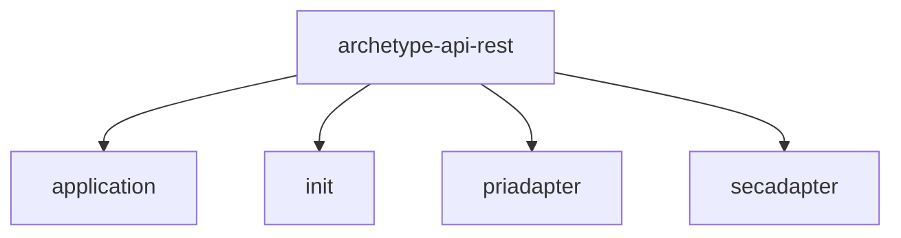
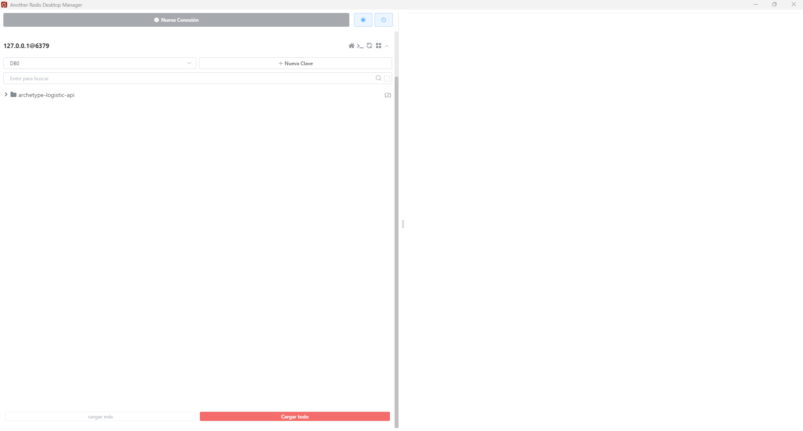
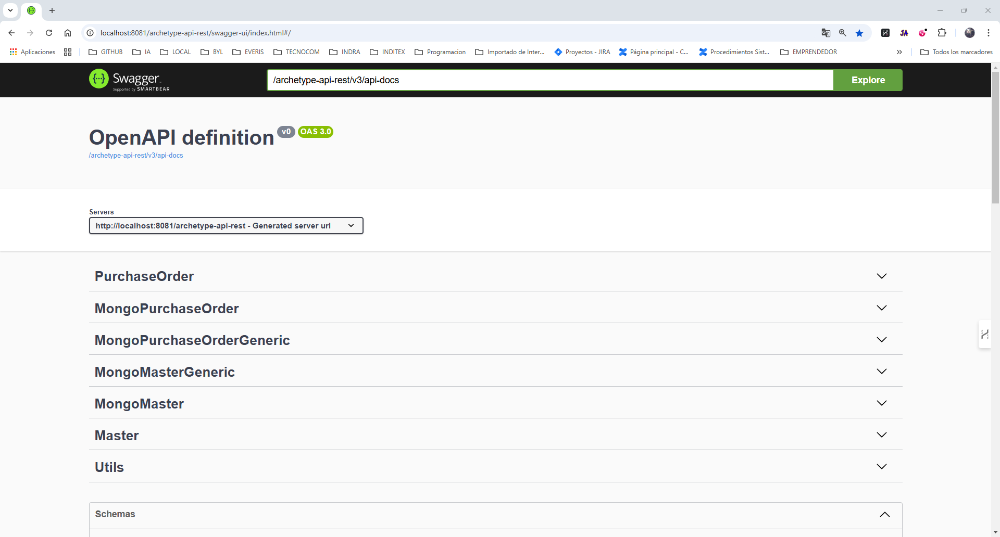

# Arquetipo API REST

Arquetipo para proyectos que exponen un API Rest.

Sigue una arquitectura hexagonal.



## Pre-requisitos 📋

* Jdk21
* Docker

## Dependencias

```
<!-- DEPENDENCIES_START -->
<!-- DEPENDENCIES_START -->
```

## Comenzando 🚀

Pasos a seguir para poder arracar el proyecto:

1. Descargar el proyecto de docker desde github.

```
git clone https://github.com/Mdr1983/docker.git
```

2. Descargar el proyecto de archetype-api-rest desde github.

```
git clone https://github.com/Mdr1983/archetype-api-rest.git
```

3. Seguir las indicaciones de la sección [Instalación](#instalacion)  

### Características

Algunas de las características del proyecto son:

1. Almacena auditoria de todas las peticiones entrantes y salientes (REST) en 2 tablas de la BBDD
   1. Tabla audit_entry
      1. Almacena la auditoria de las peticiones entrantes a la app
   2. Tabla audit_exit
      1. Almacena la auditoria de las peticiones salientes a otras app
2. Envía las metricas de la aplicación usando la libreria micrometer
   1. Éstas métricas se envían usando Prometheus
3. Los logs se envían a elastic
4. Se usa spring cloud sleuth para la trazabilidad de los microservicios
5. Se usa la librería spy para monitorizar el rendmiento de las sql a BBDD.
   6. La configuración se hace en el fichero spy.properties
   6. Por defecto esta configurado a que loguee todas las sql que superen los 3s.
7. Todas las entradas de json al API realizan una validación contra json schemas usando las librerias jackson y networknt
   8. La clase que engloba estas validaciones es JsonValidationSchema.java

## Instalación 🔧 {#instalacion}

Por defecto la aplicación se inicia en el puerto **8081**.

El API de entrada de swagger sería http://localhost:8081/archetype-api-rest/swagger-ui/index.html#/ 

### Compilar aplicación

```
mvn clean install
```

### Arrancando docker

Abrir un terminal cmd, situarse en la carpeta del proyecto de "docker" descargado y ejecutar el comando siguiente:

```
docker-compose up
```

Este comando iniciará las distintas apps necesarias para el funcionamiento de la aplicación.

Estas aplicaciones son las siguientes:

* Postgres
  * Arranca en el puerto 15432 
* Mongo
    * Arranca en el puerto 27017 
* Grafana
    * http://localhost:3000/
* Prometheus
  * http://localhost:9090/graph
* Elastic
  * http://localhost:9200/
* Kibana
    * http://localhost:5601/app/home#/
* Redis
  * Acceder con un cliente para Redis como por ejemplo "Another Redis Desktop Manager" https://goanother.com/
  * Arranca en el puerto 6379
  


### Arrancar aplicación

#### Si se inicia con el SCCS

En el fichero bootstrap.yml esta definido el acceso a SCCS 

```
spring:
  application:
    name: archetype-api-rest
  cloud:
    config:
      failFast: true
      enabled: true
      name: ${spring.application.name}
      profile: ${PROFILE}
      uri: ${SCCS}
      server:
        git:
          search-paths: config
logging:
  config: ${SCCS}/sccs/${spring.application.name}/${PROFILE}/master/base_logback.xml
```

##### Variables de entorno a configurar para el SCCS

1. GITHUB
    1. URL del repositorio de Git para el uso con el SCCS
2. SCCS
    1. URL del servidor de SCCS
3. PROFILE
    1. Profiles a ejecutar
        1. h2
            1. Inicia la aplicación con una BBDD en memoria en H2
        2. local
            1. Inicia la aplicación con la BBDD de postgres del Docker

```
GITHUB=https://github.com/Mdr1983/config.git;
SCCS=http://localhost:8889;
PROFILE=local;
```

#### Si no se inicia con el SCCS

En el fichero bootstrap.yml esta definido el acceso a SCCS.

Hay que comentar su contenido, excepto la parte de logging.

```
#spring:
#  application:
#    name: archetype-api-rest
#  cloud:
#    config:
#      failFast: true
#      enabled: true
#      name: ${spring.application.name}
#      profile: ${PROFILE}
#      uri: ${SCCS}
#      server:
#        git:
#          search-paths: config
logging:
  config: classpath:logback_conf.xml
```

##### Variables de entorno a configurar sin el SCCS

1. PROFILE
    1. Profiles a ejecutar
        1. h2
            1. Inicia la aplicación con una BBDD en memoria en H2
        2. local
            1. Inicia la aplicación con la BBDD de postgres del Docker

```
PROFILE=local;
```

#### Iniciar aplicación

##### Iniciar aplicación con profile local

```
java -jar init/target/init.jar -Dspring-boot.run.profiles=local
```

##### Iniciar aplicación con profile h2
```
java -jar init/target/init.jar -Dspring-boot.run.profiles=h2
```

### Verificar arranque aplicación

Si todo ha ido correcto la aplicación se iniciará y se podrá verificar con swagger. 

Para ello acceder a la URL http://localhost:8081/archetype-api-rest/swagger-ui/index.html#/



## Ejecutando las pruebas ⚙️

_Explica como ejecutar las pruebas automatizadas para este sistema_

### Analice las pruebas end-to-end 🔩

_Explica que verifican estas pruebas y por qué_

```
Da un ejemplo
```

### Y las pruebas de estilo de codificación ⌨️

_Explica que verifican estas pruebas y por qué_

```
Da un ejemplo
```

## Despliegue 📦

_Agrega notas adicionales sobre como hacer deploy_

## Construído con 🛠️

_Herramientas usadas_

* [Spring](https://spring.io/) - Framework web
* [Maven](https://maven.apache.org/) - Manejador de dependencias
* [Postgres](https://www.postgresql.org/) - BBDD relacional
* [Mongo](https://www.postgresql.org/) - BBDD No relacional
* [Grafana](https://grafana.com/) - Monitorización
* [Prometheus](https://prometheus.io/) - Monitorización
* [Elastic](https://www.elastic.co/es/) - Logs
* [Kibana](https://www.elastic.co/es/kibana) - Visualización Logs
* [Redis](https://redis.io/) - Cache redis


## Contribuyendo 🖇️

Por favor lee el [CONTRIBUTING.md](https://gist.github.com/villanuevand/xxxxxx) para detalles de nuestro código de conducta, y el proceso para enviarnos pull requests.

## Wiki 📖

Puedes encontrar mucho más de cómo utilizar este proyecto en nuestra [Wiki](https://github.com/tu/proyecto/wiki)

## Versionado 📌

Se utiliza [SemVer](http://semver.org/) para el versionado. 

Para todas las versiones disponibles, mira los [tags](https://github.com/Mdr1983/archetype-api-rest/tags).

## Autores ✒️

* **Manuel Demanuel Rodríguez** - [Mdr1983](https://github.com/Mdr1983)

También puedes mirar la lista de todos los [contribuyentes](https://github.com/Mdr1983/archetype-api-rest/graphs/contributors) quíenes han participado en este proyecto.

## Licencia 📄

Este proyecto está bajo la Licencia (MIT) - mira el archivo [LICENSE.md](LICENSE.md) para detalles

## Anexos

### Creación del arquetipo

Para crear el arquetipo en base al proyecto actual se debe ejecutar lo siguiente:

```
mvn archetype:create-from-project
```
